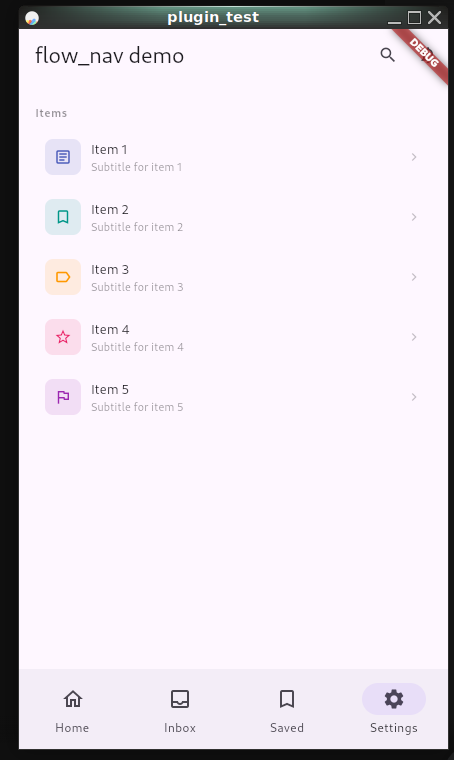
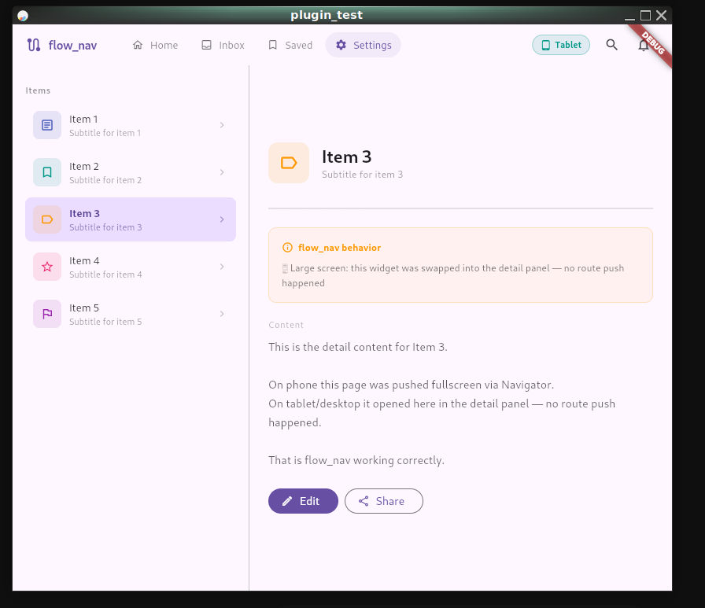
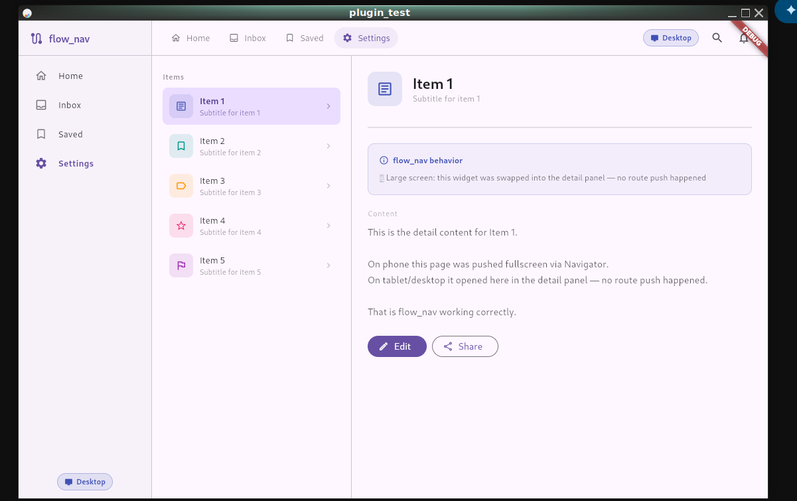

# flow_nav

[](https://pub.dev/packages/flow_nav)
[](https://github.com/cas8398/flow_nav/blob/main/LICENSE)
[](https://flutter.dev)
[](https://dart.dev)

**Dynamic navigation and layout orchestration for Flutter.**

`flow_nav` automatically adapts your app's layout and navigation behavior based on screen size — no manual breakpoint handling, no platform checks scattered across your codebase. Write once, run beautifully on phone, tablet, and desktop.

---

## Screenshots

| Phone                                    | Tablet                                     | Desktop                                      |
| ---------------------------------------- | ------------------------------------------ | -------------------------------------------- |
|  |  |  |

---

## Features

- 📱 **Adaptive AppBar** — standard `AppBar` on phone, custom toolbar/menubar on tablet and desktop
- 🔀 **Adaptive Navigation** — full-screen push on phone, detail panel swap on large screens
- 🏗️ **Adaptive Layout** — single column (phone), split view (tablet), three-column (desktop)
- 🔌 **Router Agnostic** — works with the default `Navigator`, GoRouter, GetX, AutoRoute, or any custom router
- 🪶 **Pure Logic, No UI Opinions** — zero forced styling; bring your own widgets

---

## Getting Started

Add `flow_nav` to your `pubspec.yaml`:

```yaml
dependencies:
  flow_nav: ^1.0.0
```

Then run:

```sh
flutter pub get
```

---

## Usage

### 1. Initialize in `main.dart`

Call `FlowNavConfig.init()` before `runApp`. This is where you configure your breakpoints and (optionally) your router hooks.

```dart
void main() {
  FlowNavConfig.init(
    tabletMinWidth: 600,
    desktopMinWidth: 1024,
  );
  runApp(MyApp());
}
```

---

### 2. Router Integration

`flow_nav` is router-agnostic. Pass your own `onPush` / `onPop` callbacks and it will use them automatically on phone (detail panel swap is used on larger screens instead).

#### Default Navigator (no setup needed)

Works out of the box with no extra configuration.

#### GoRouter

```dart
FlowNavConfig.init(
  onPush: ({required context, required builder, fullscreenDialog = false}) {
    context.push('/detail');
    return Future.value(null);
  },
  onPop: (context) => context.pop(),
);
```

#### GetX

```dart
FlowNavConfig.init(
  onPush: ({required context, required builder, fullscreenDialog = false}) {
    return Get.to(() => builder(context));
  },
  onPop: (_) => Get.back(),
);
```

#### AutoRoute

```dart
FlowNavConfig.init(
  onPush: ({required context, required builder, fullscreenDialog = false}) {
    return context.router.push(MyRoute());
  },
  onPop: (context) => context.router.pop(),
);
```

---

### 3. Use `FlowScaffold`

Replace your standard `Scaffold` with `FlowScaffold`. It handles the layout columns automatically.

```dart
class MyHomePage extends StatefulWidget {
  @override
  State<MyHomePage> createState() => _MyHomePageState();
}

class _MyHomePageState extends State<MyHomePage> {
  Widget? _detail;

  @override
  Widget build(BuildContext context) {
    return FlowScaffold(
      appBar: FlowAppBar(
        title: Text('My App'),
        toolbarWidget: MyDesktopToolbar(), // shown only on tablet/desktop
      ),
      body: MyListView(
        onItemTap: (item) {
          FlowNavController.open(
            context: context,
            builder: (_) => DetailPage(item: item),
            // Called on tablet/desktop — swap the detail panel instead of pushing
            onDetailOpen: (widget) => setState(() => _detail = widget),
          );
        },
      ),
      detailPanel: _detail,   // shown beside body on tablet/desktop
      sidebar: MySidebar(),   // shown only on desktop (left column)
    );
  }
}
```

---

## API Reference

### `FlowNavConfig.init()`

Configures global settings. Call once before `runApp`.

| Parameter         | Type         | Default           | Description                                       |
| ----------------- | ------------ | ----------------- | ------------------------------------------------- |
| `tabletMinWidth`  | `double`     | `600`             | Minimum width to enter tablet layout              |
| `desktopMinWidth` | `double`     | `1024`            | Minimum width to enter desktop layout             |
| `bodyMaxWidth`    | `double?`    | `null`            | Max width of content area                         |
| `bodyPadding`     | `EdgeInsets` | `EdgeInsets.zero` | Inner padding for body                            |
| `bodyMargin`      | `EdgeInsets` | `EdgeInsets.zero` | Outer margin for body                             |
| `onPush`          | `Function?`  | `null`            | Custom navigation push (for GoRouter, GetX, etc.) |
| `onPop`           | `Function?`  | `null`            | Custom navigation pop                             |

---

### `FlowScaffold`

The main adaptive scaffold widget.

| Property               | Type                   | Description                                                              |
| ---------------------- | ---------------------- | ------------------------------------------------------------------------ |
| `appBar`               | `PreferredSizeWidget?` | Adaptive AppBar — shown on phone, converted to toolbar on larger screens |
| `body`                 | `Widget`               | Main content (list, grid, etc.)                                          |
| `detailPanel`          | `Widget?`              | Detail view shown beside body on tablet/desktop                          |
| `sidebar`              | `Widget?`              | Left sidebar shown only on desktop                                       |
| `sidebarWidth`         | `double`               | Sidebar width (default: `240`)                                           |
| `bodyPanelWidth`       | `double`               | List panel width on tablet/desktop (default: `320`)                      |
| `maxWidth`             | `double?`              | Max width of entire content area                                         |
| `bodyPadding`          | `EdgeInsets?`          | Inner padding for body panel                                             |
| `bodyMargin`           | `EdgeInsets?`          | Outer margin for body panel                                              |
| `backgroundColor`      | `Color?`               | Scaffold background color                                                |
| `emptyDetail`          | `Widget?`              | Placeholder shown when no detail is selected                             |
| `bottomNavigationBar`  | `Widget?`              | Bottom nav (phone/tablet only)                                           |
| `floatingActionButton` | `Widget?`              | FAB                                                                      |
| `drawer`               | `Widget?`              | Drawer (phone/tablet)                                                    |
| `forceScreenType`      | `FlowScreenType?`      | Override screen type (useful for testing/previews)                       |
| `bodyAlign`            | `FlowBodyAlign`        | Align body when `maxWidth` is set (`start` or `center`)                  |

---

### `FlowAppBar`

An adaptive AppBar that renders as a standard `AppBar` on phone and as a custom toolbar widget on larger screens.

```dart
FlowAppBar(
  title: Text('My App'),
  toolbarWidget: Row(
    children: [
      Text('My App', style: TextStyle(fontSize: 18)),
      Spacer(),
      IconButton(icon: Icon(Icons.settings), onPressed: () {}),
    ],
  ),
)
```

---

### `FlowNavController.open()`

The primary way to navigate to a detail view. Automatically pushes a new route on phone, or calls `onDetailOpen` on tablet/desktop.

```dart
FlowNavController.open(
  context: context,
  builder: (_) => DetailPage(item: item),
  onDetailOpen: (widget) => setState(() => _detail = widget),
  fullscreenDialog: false, // optional
);
```

---

### `FlowNavBreakpoint.of(context)`

Returns the current `FlowScreenType` for the given context. Useful for conditional rendering outside of `FlowScaffold`.

```dart
final screenType = FlowNavBreakpoint.of(context);

if (screenType == FlowScreenType.phone) {
  // phone-specific logic
}
```

**`FlowScreenType` values:** `phone`, `tablet`, `desktop`

---

## Layout Behavior Summary

| Feature    | Phone             | Tablet                       | Desktop                        |
| ---------- | ----------------- | ---------------------------- | ------------------------------ |
| AppBar     | Standard `AppBar` | Toolbar at top of split view | Toolbar at top of content area |
| Layout     | Single column     | Body + Detail panel          | Sidebar + Body + Detail panel  |
| Navigation | Full-screen push  | Detail panel swap            | Detail panel swap              |
| Bottom nav | ✅ Shown          | ❌ Hidden                    | ❌ Hidden                      |
| Drawer     | ✅ Shown          | ✅ Shown                     | ❌ Hidden                      |

---

## Requirements

- Dart SDK: `^3.6.0`
- Flutter: `>=3.0.0`

---

## Contributing

Contributions are welcome! Please open an issue or pull request on [GitHub](https://github.com/cas8398/flow_nav).

---

## License

[MIT](https://github.com/cas8398/flow_nav/blob/main/LICENSE)
